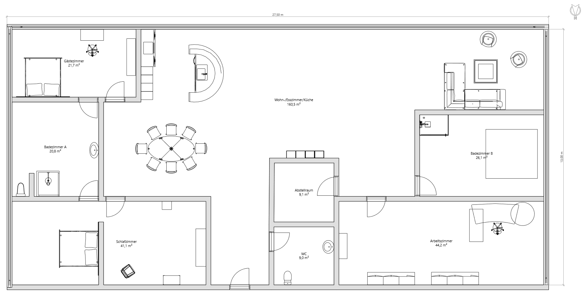

# Akt 1 Sebastians Geheimnis

Nach der Beisetzung verabschiedet Ihr euch und geht nach Hause.

Einer der Spieler erhält einen Brief als er Zuhause ankommt. In Ihm ein Plakat
enthalten ist.

[]

Das Plakat hat ausgerissene Ecken, sieht aus als wäre es schon etwas ausgebleicht und wurde in der Vergangenheit öfters nass. Auf der Rückseite steht ein URL, eine
Nutzerkennung und ein Passwort. Unterschrieben mit `Sebastian` 

Mit Hilfe der Daten kann man einen Account für ein VR spiel erstellen. Die Liste
der bereits erstellten Accounts beinhaltet die Namen der Spieler.

Bringen Sie die Spieler dazu sich gemeinsam einzuloggen.

> Nachdem Ihr euch eingeloggt habt fällt euch zuerst ein Baum ins Auge an dem
> mehrere Plakate hängen, er steht am Rande eines Platzes der aus festgetretener
> Erder besteht. Um den Platz herum stehen mehrere Bänke der Platz selbst ist
> mit einer Trockenmauer von der umgebenen Wiese abgetrennt. Viel mehr nehmt Ihr
> nicht wahr bevor euch auffällt das eure Avatare exakt so aussehen wie Ihr. Nur
> eure Klamotten sind andere als wert ihr Darsteller in einem 30er Jahre Film.

Die Spieler sollten jetzt einen Moment haben zu reagieren und sich zu wundern,
eventuelle. Wenn sie sich weiter umsehen oder sich umdrehen bekommen Sie weitere
eindrücke.

> Hinter euch erhebt sich am Horizont eine gewaltige Stadt mit etlichen
> Hochhäusern. Am Himmel befinden sich mehrere Luftschiffe, einige von Ihnen
> schein an Hochhäusern in der Stadt befestigt zu sein, andere verlassen die
> Stadt oder Nähern sich ihr. Ein Kleiner weg führt hinab zu einer Straße. Dort
> scheint sich auch eine Bushaltestelle zu befinden.

Wenn sich die Spieler den Baum anschauen finden sie mehrere Plakate zu
verschiedenen Clubs und Bigbands. Ein sehr Zentrales Plakat wurde scheinbar vor
kurzem Abgerissen. Die abgerissenen Ecken sind noch nicht verblasst. Neben dem
Abgerissenem Plakat befindet sich eines was Informationen zu einem Nachtklub
besitzt. Der `Chees Club` Rühmt sich die Sängerin Veronika für ein Jahr als
Gastsängerin zu beherbergen. Dazu einige hervorgehobene Speisen, Getränke und
weitere Informationen

Die Spieler besitzen Ausweise etwas Bargeld und eine Kreditkarte Eventuell
zusätzlich noch weitere Passende Gegenstände je nach Aspekten des Charakters.
Die Spieler sollten keine Finanziellen Probleme haben wenn sie mit Kreditkarte
bezahlen. Allerdings haben sie erstmal keine Möglichkeit Ihren Kreditrahmen zu
erfahren. Dies sollte verhindern das sie mit Geld um sich werfen aber dennoch
muss man nicht haarklein Buch führen. Sollten Sie es übertreiben können Sie
immernoch eine Warnung der Kreditgeschäft ausstellen die die Einhaltung des
Kreditrahmens anmahnt.

Es dauert nicht lange bis ein Bus vom `Alten Himmel` in Die Stadt `Satora`
fährt. Beide Namen erfährt man von dem Busfahrplan. In der Stadt selbst sind
nahezu keine Autos unterwegs, Dafür fahren mehrere Magnetschwebebahnen über den
Köpfen der Spieler. In den Straßen befinden sich einige Kleine Läden. Einige
verkaufen Nahrungsmittel, aber auch Werkzeuge und verschieden Materialien wie
Farben fallen euch ins Auge. Es gibt auch die Möglichkeit die Aktuelle
Tageszeitung über eine Art Rohrpost System an der Straßen ecke zu beziehen.
Scheinbar kann darüber auch Post verschickt werden.

Das Datum der Zeitung ist der 13.8.1397. Auf der Titelseite ist ein Bericht über
eine Neues Bauprojekt welches kurz vor kurzem Vollendet wurde. Weitere
Nachrichten die man sieht wenn man ein Exemplar Kauft

* Ein Bericht über Handelsabkommen mit einem Benachbarten Staat 
* Die Verschlechterung der Meeresströmungen was Warentransporte über den großen
  Teich noch mehr auf die Luftfahrt verschiebet
* Ein Mordserie bei der bereits das 7 Opfer entdeckt wurde. Deren Gemeinsamkeit
  ist das die Opfer alle unterschiedlich starben, jedoch Ihre Leichen gut
  versteckt wurden.

## Der Chess Club

In dem Club kann eine Probe Mitgliedschaft erworben werden, man scheint sehr auf
Diskretion bedacht und keine Fragen zu stellen, Jeder kann Mitglied werden.

Die Front des Clubs besitzt eine Große Leuchtreklame die Den Namen in
Geschwungener Schrift darstellt. Der Eingang ist einige Meter von der Straße
Zurückgesetzt sodass das Gebäude selbst einen Schutz vor regen für die Wartenden
Besucher darstellt. An den Seiten laufen die Wände in einem 45° Winkel auf den
Eingang zu, eine Große Doppelflügiegen Tür die aus dunklem Holz mit Goldeinlässen.
In einigem Abstand vor der Tür befindet sich ein Pult an dem der Portier die
Gäste empfängt.

In diesem Viertel seid Ihr schon an einigen Clubs vorbeigekommen, dies mag nicht
der Prunkvollste von Ihnen sein, aber er ist nicht allzu weit davon entfernt.

Der Portier wird die Spieler fragen ob sie Mitglied sind und Ihnen ansonsten eine
Mitgliedschaft anbeten. Anschließend wird ein Page die Gruppe an der Pforte
abholen und zu Ihrem Platz bringen.

Die Gänge sind Breit und immer wieder gesäumt von Kunstwerken, nicht Viele, was
aber nur Ihre Exklusivität hervorzuheben scheint. Der Rote Teppich leitet den
Weg zum Hauptsaal. Beim betreten dieses erhält die Gruppe eine Gute Übersicht
des Riesigen Raumes. Die Beleuchtung ist stark gedimmt so das der Fokus
vollkommen auf die Hellerleuchtete zentrale Bühne gelenkt wird auf der Zurzeit
eine Bigband spielt. Alles in diesem Raum scheint auf diese Ausgerichtet zu
sein. Der Raum ist auf 3 Ebenen aufgeteilt auf jeder Ebene befinden sich mehrere
Runde Tische mit kleinen schwach leuchtenden Lampen, hell genug zu Sehen das
sich dort ein Tisch befindet, aber nicht stark genug um zu erkennen wer dort
sitzt. Die Tische haben genügend Abstand voneinander und mit einigen
Pflanzkübeln dazwischen so dass man sich ungestört unterhalten kann unbehelligt
von den Anderen Gästen und mit freiem Blick auf die Bühne. Neben den Tischen
kann man auch noch auf der oberster Ebene eine Bar sehen an die man sich setzen
kann.

Der Tisch zu den die Gruppe geleitet wird, befindet sich auf der Obersten ebene,
und ist Groß genug um ohne Probleme zwei oder drei Weitere Gäste zu bewirten.

Im laufe des Abends wird `Veronika` auftreten. Man kann ein treffen über einen
der Kellner arrangieren, oder z.B. Der Bardame `Katharina` (Die auch
Eigentümerin ist auch wenn es nicht zur schau gestellt wird). Man muss etwas
Überzeugungsarbeit leisten, für ein Treffen oder den Namen `Sebastian` fallen
lassen.

Sebastian traf sich sehr oft mit Veronika und hatte sich in Sie verliebt.
Allerdings ist er seit einigen Tagen spurlos verschwunden Seine Wohnung ist
unangetastet er hat keine Klamotten gepackt. Veronika macht sich sorgen um Ihn.
Er sagte er würde verfolgt werden. Sie kann auch die Adresse nennen, und kann
auch einen Wohnungsschlüssel überlassen. Sie schient Prinzipielles vertrauen zu
der Gruppe zu haben, da Sebastian wohl einige seiner Freunde von weit her öfters
schon erwähnte.

## Die Wohnung

Die Wohnung ist Aufgeräumt, wenn auch einige Alltaggegenstände nicht weggeräumt
wurden. Sie befindet sich im Obersten drittel eines Hochhauses und umfasst fast
die hälfte der Etage, Sie belegt die komplette Südseite sowie teile der Ost und
Westseite Seite. Nicht nur die Lage scheint Exklusiv zu sein, auch die
Einrichtung ist Luxuriös. 

### Wohn-/Esszimmer/Küche

Eine schöne Küche, ein Großer Esstisch und eine Sofa Landschaft. Eingelassen in
einem Sehr großzügigen Raum. An den Wänden sind Einige Regale mit Zeitschriften,
Belletristik und einigen Deko Objekten. Es gibt auch ein Radio aber keinen
Fernseher. Die Küche besitzt einen Elektro Herd eine Mikrowelle Kühlschrank und
Spülmaschine.

### WC

Ein Große aber sonst nicht interessantes Gäste WC.

### Schlafzimmer

Das Schlafzimmer ist zweigeteilt, der Hintere teil ist ein Begehbarer
Kleiderschrank mit ankleide Möglichkeiten. Eine Vielzahl von Hosen, Hemden und
Jacketts hängen an den Kleiderstangen. Aber auch ein zwei teile für Damen.

Im vorderen Teil befindet sich das Bett mit einem Sehr Schönen Ausblick über die
Stadt.

Bei genauerer Inspektion kann man im Nachttisch eine Angebrochene Schachtel Patronen finden

### Gästezimmer

Ein großes Bett, Schreibtisch und ein Schrank wo genug Platz drin ist um seine
Kleider unter zu bringen.

### Badezimmer A

Ein normales Badezimmer mit Dusche, bei dem Waschbecken befinden sich auch die
üblichen Utensilien, wie z.B. Rasierer. Aber auch Zwei Zahnbürsten.

### Badezimmer B

Dieser Raum besitzt nur eine Dusche und eine Sehr große Badewanne oder ein
kleiner Pool je nachdem wie man es sieht. Die Wassertiefe geht Stufenweise bis
auf 70 cm herunter. An der Wand befindet sich ein Panel zum einstellen der
Wassertemperatur.

### Abstellraum

In diesem befindet sich alles mögliche an Dingen die man für einen Haushalt
braucht, Waschmaschine, Trockner Bügelbrett Putzzeug, Werkzeug aber auch
Konserven und andere Vorräte.

### Arbeitszimmer

Während der Rest der Wohnung sehr Ordentlich und Aufgeräumt ist sieht es Im
Arbeitszimmer nicht ganz so ordentlich aus. Auf dem Schreibtisch und dem Boden
stapeln sich Papiere. Eine Große Karte der Stadt ist auf dem Boden Ausgebreitet.

Es lassen sich auch verschiedene Abrechnungen in den Ordnern im Schrank finden,
beispielsweise zum Kauf dieser Wohnung (7.000 Taler vor einigen Monaten)
Mitglied im Chess Club, Eine Angemietete Lagerhalle, einige Rechnungen die er
ausgestellt hat bei dem er einige Gegenstände verkauft hat.

Die Unterlagen die sich in den Stapeln befinden beziehen sich auf eine Mordserie
die zurzeit in der Stadt stattfindet, Ein Forschungslabor etwas außerhalb der
Stadt, und politische Entwicklungen. Zudem noch eine Riesige liste von Einträgen
die wie ein Log aussehen.

#### Die Mordserie

Über die Letzen Monate ereigneten sich viele Morde deren Zeitungsartikel sich
hier finden. Aber auch zu einigen Unfällen kann man Informationen Finden.

Es schein etwas gedauert zu haben bis die Öffentlichkeit die Einzelnen Morde
miteinander verknüpfte, da Sie außer der Schwierigkeit der Leichen zu finden 
keine Gemeinsamkeit haben. Sie sind so unterschiedlich wie sie nur Sein konnten.

Es scheint eine Regelmäßigkeit zu geben die Hervorgehoben wurde, die Ersten
fälle sind Unregelmäßig, dann gibt es eine längere Pause, danach treten die
Fälle quasi wöchentlich auf.

Die Unterlagen gehen bis kurz vor dem Tod von `Sebastian`.

#### Die Logliste

Es dauert etwas die gesamte Liste durchzugehen.

In der Liste sind vor allem einige Loginvorgänge markiert. Von 2 Accounts, Kurz
bevor ein Eintrag zur Löschung des erstens auftaucht wird der zweite angelegt,
im Gegensatz zum ersten ist dies ein Externer Account der scheinbar von
außerhalb des internen Netzes genutzt werden kann.

Bei genauerer Untersuchung nicht nur der Markierten findet sich auch das
anlegen der Accounts der Spieler, und des Verstorbenen. Sowie dessen
nutzungsverhalten.

Die Unterlagen gehen bis kurz vor dem Tod von `Sebastian`.

#### Das Forschungslabor

Es gibt nicht viele Informationen über das Forschungslabor Zeitungsartikel
einige Genehmigungen und Fotographien. Das Labor scheint ein
Grundlagenforschung im Bereich der Teilchenphysik zu betreiben.

Bei genauerer Betrachtung scheinen die Bilder Unterschiedlich zu sein, Die Gebäude sind ähnlich, aber die Umgebung sieht Anders aus, während auf der einen ein kleiner Wald zu stehen scheint, sitzt die andere Auf einem Hügel.

[]

#### Politische Entwicklung

Scheinbar war die Lage zwischen dieser Nation und einer Ihrer Nachbarnationen
angespannt, jedoch scheint sich dies zu entspannen.

## Die Lagerhalle

Einige Skulpturen stehen in der Großen Lagerhalle. Gehauen aus stein oder
Geschweißt aus Altmetall. Eine Vielzahl an Werkzeugen finden sich in der
Geräumigen halle.

In einer Ecke befindet sich eine improvisiert zusammengefrikelte Dusche,
gefertigt aus einer Vielzahl wild zusammengestellter Leitungsrohre.

Etwas davon entfernt befindet sich ein kleiner Schreibtisch mit Rollcontainer
und einigem Papierkram.

### Der Schreibtisch

Einige geöffnete Briefe liegen auf dem Tisch. Neben einigen Lieferscheinen auch
folgendes:

> Kommen Sie an das Ufer des 3. Flusses, wenn Sie Antworten auf Ihre Fragen
> haben wollen.

Das Datum der Lieferscheine ist `Sebastians` Todestag. 

## Sebastians Entdeckung

Von den Infos sollten die Spieler in der Lage sein herauszufinden das sie Infos
in der Zeitung kurz nach dem Todestag `Sebastians` finden könnten.

Dort wird von einem jungen Man berichtet der in den Fluss gefallen ist, und nun
im Koma liegt.

Er wurde Treibend im Fluss gefunden.

Sollten Die Spieler nicht in der Lage sein dies Herauszufinden, kann Jemand Sie nach einigen tagen Informieren das `Sebastian` gefunden wurde.

Er liegt im Krankenhaus.

## Das Forschungslabor

Das Forschungslabor befindet sich abseits der Stadt und Sieht verlassen aus. Es
brennt nirgends licht abgesehen von einer Straßenlaterne. Ansonsten scheint es
in Gutem Zustand zu sein.

Dieses Bild ergibt sich zu jeder Tageszeit. Es wird nicht möglich sein
herauszufinden wer dort Arbeitet.

Mann kann eigentlich nur einbrechen.

Wenn man durch die Flure geht, sieht es nur Oberflächlich aus als würde es
genutzt werden. In Akten liegen nur Leere Zettel und bei Papierstapeln ist nur
die Erste Seite Bedruckt, und das mit auf den Zeiten blick Nonsens.

Der Hauptgang Läuft einmal rund um das Gebäude mit Büros an den Außenseiten.
Wenn man Ihn Abläuft kommt man auch am Empfang vorbei.

Es Gibt nur eine Größere Tür die zum Zentrum führt. Dort steht man in eine Art
Kontrollraum mit schrägen aussichtsfenstern ins innere.

In Diesem Ist ein gewaltiger Raum, der 30m oder mehr in die Tiefe Reicht.
Surreal Anmaßend steht eine gewaltige Apparatur wie aus einem Sci-Fi Film. Blitze
springen von einer Teslaspule zur nächsten, Ringe Drehen sich um Mehrere Achsen
schwebend in der Luft. Duzende Streben und Rohre Führen wie ein Labyrinth
undurchsichtig durch den Raum. Und überall sind Mysteriöse leuchtende Symbole und
Linien.

Vom Überwachungsraum führt eine Leiter Nach unten. Über mehrere Stege und
weitere Leitern gelangt man schließlich auf den Boden. In dessen Zentrum
befindet sich ein großer Leuchtender Kreis der Ebenfalls mit merkwürdigen Linien
und Zeichen versehen ist.

auf der Andern Seite des Raumes führt wieder eine Leiter nach oben, ähnlich wie
auf dem Hinweg über mehrere Stege. An dessen Ende befindet sich wieder ein
Kontrollraum. Wenn man Ihn wieder verlässt befindet man sich wieder auf dem
Schon bekannte Flur.

Aber es gab nur eine Tür die zur Mitte führte warum ist hier noch eine Zweite?
Die Spieler sind zurück in Ihrer Eigenen Welt (als Ihre Avatare)

Außerhalb des Forschungszentrum können die Spieler von einem Hügel herab Ihre
Stadt sehen.

Im Forschungszentrum können Sie herausfinden welcher Person zum Login gehört.
Und auch seine Letzte bekannte Adresse.

## Der Killer

Der Täter heißt `Tim Müller`. Er war angestellter des Forschungslabors.

Je nachdem wie auffällig sich die Spieler verhalten, kann der Täter Ihnen
bereits auf der Spur sein.

Andernfalls können Sie versuchen Ihn in Seiner Wohnung zu stellen.

Dies sollte der Klimax des Abenteuers sein und für die Spieler entsprechend
spannend. Je nachdem wie kampferprobt die Charaktere sind, kann dies ein Offener
Kampf, eine Verfolgungsjagd oder ein Hinterhalt werden.

Es wäre gut wenn er nicht einfach stirbt, da sein Gespräch noch ein paar
Informationen birgt.

Am ende sollte ein Mysteriöser Gentleman die Bühne betreten, entweder als Deus
Ex-Machina um die Spieler aus ihrer misslichen Lage zu befreien oder nachdem
diese Ihren Feind gestellt haben.

Im Idealfall argumentiert der Täter das die Personen in der Simulation nur NPC
sind und nicht wirklich leben, worauf der Gentleman erwidert das sie sich somit
nicht von Ihm Unterschieden.

Prinzipiell klärt der Gentleman die Spieler auf das sie selbst eine VR sind.
Lassen Sie ihn aber Kurzangebunden wirken und alles was er erklärt wie eine
Selbstverständlichkeit wirken.

Der GGentleman heißt `Ruthworth` und erklärt den Spielern das Ihre Welt und alle
Anderen dem Untergang geweiht sind. Immer mehr Fehler schleichen sich ein und er
versucht dies zu ändern.

Er selbst stammt aus einer Simulation des zweiten Levels, also eine Simulation
die von der Ursprünglichen Simulation erschaffen wurde. die Spieler stammen aus
einer VR der 4. stufe.

Dies ist das Ende des Ersten Aktes die Spieler können nun Auf Leveln. Prinzipiell
können auch sehr fantastische Fähigkeiten wie fliegen und ähnliches gewählt
werden, da die Spieler einen Blick hinter die Welt werfen konnten.
